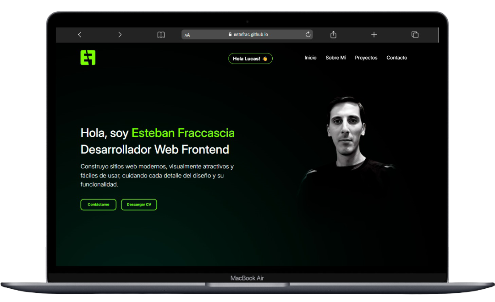

# Portfolio Web - Entrega Final curso de Javascript CODERHOUSE

Este proyecto es la versión final de mi portfolio web, desarrollado con **HTML**, **CSS** y **JavaScript**. Ahora incluye integración con librerías externas para mejorar la experiencia y funcionalidad:

- **Axios** para consumir datos desde un archivo JSON.
- **EmailJS** para enviar mensajes de contacto directamente desde el frontend.
- **SweetAlert2** para mostrar modales modernos.

---

## ✅ Funcionalidades Implementadas

### 1. Carga Dinámica de Proyectos desde JSON

- **Consumo de datos con Axios**: Los proyectos se cargan dinámicamente desde un archivo JSON usando Axios.
- **Generación de elementos**: Uso del DOM para crear y mostrar las tarjetas de proyectos.
- **Detalles interactivos**: Al hacer clic en un proyecto, se oculta la lista principal y se muestran los detalles específicos del proyecto seleccionado.
- **Navegación intuitiva**: Botón **"Volver"** para regresar a la vista de todos los proyectos.

### 2. Sistema de Saludo Personalizado

- **Almacenamiento local**: Uso de `localStorage` para guardar el nombre del usuario cuando completa el formulario de contacto.
- **Recuperación de datos**: Al cargar la web, se verifica si existe un nombre guardado previamente en `localStorage`.
- **Experiencia personalizada**: Mensaje de bienvenida que se muestra al usuario cuando vuelve a visitar la página, saludándolo por su nombre.

### 3. Envío de Mensajes con EmailJS

- **Integración con EmailJS**: Permite enviar mensajes de contacto directamente desde el frontend, sin backend propio.
- **Validación nativa**: El formulario utiliza validación HTML para asegurar que los datos sean correctos antes de enviar.

### 4. Modales Personalizados con SweetAlert2

- **Feedback visual**: SweetAlert2 muestra modales para el estado de envío y confirmación de mensajes.
- **Experiencia de usuario**: Confirma al usuario que su mensaje ha sido enviado correctamente o muestra errores si ocurre algún problema.

---

## ✅ Tecnologías Utilizadas

-  **HTML5**: Estructura semántica del portfolio.
-  **CSS3**: Estilos y diseño responsive.
-  **JavaScript ES6+**: Funcionalidades dinámicas e interacciones.
-  **Axios**: Consumo de datos desde JSON.
-  **EmailJS**: Envío de emails desde el frontend.
-  **SweetAlert2**: Modales personalizados y modernos.
